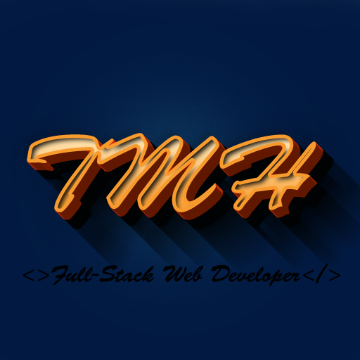

<div align="center">
  
  <br/>
  <h1>Portfolio - Than Myo Htet 🤘</h1>
</div>

<a name="readme-top"></a>

<!-- TABLE OF CONTENTS -->

# 📗 Table of Contents

- [📗 Table of Contents](#-table-of-contents)
- [ Portfolio - Than Myo Htet 🤘](#-about-project-)
	- [Live Demo](#live-demo)
	- [🛠 Built With ](#-built-with-)
		- [Tech Stack ](#tech-stack-)
		- [Key Features ](#key-features-)
	- [💻 Getting Started ](#-getting-started-)
	- [To get a local copy up and running, follow these steps.](#to-get-a-local-copy-up-and-running-follow-these-steps)
		- [Prerequisites](#prerequisites)
		- [Setup](#setup)
		- [Install](#install)
	- [👥 Authors ](#-authors-)
	- [🔭 Future Features ](#-future-features-)
	- [🤝 Contributing ](#-contributing-)
	- [⭐️ Show your support ](#️-show-your-support-)
	- [🙏 Acknowledgments ](#-acknowledgments-)
	- [📝 License ](#-license-)

<!-- PROJECT DESCRIPTION -->

# Portfolio - Than Myo Htet 🤘 <a name="about-project"></a>

This portfolio presents my proficiency and background in utilizing React JS, HTML, and CSS. It features projects I've been involved in, details about my education, and pertinent work history. The portfolio is designed to offer a lively and compelling user experience for potential employers and clients.


## Live Demo

To see this project's live demo, please click [here](https://than-myo-htet-portfolio.netlify.app/).

## 🛠 Built With <a name="built-with"></a>

This app is built with React and Tailwind.

### Tech Stack <a name="tech-stack"></a>

<details>
  <summary>Client</summary>
  <ul>
    <li><a href="https://reactjs.org/">React.js</a></li>
  </ul>
</details>

### Key Features <a name="key-features"></a>

> - About page.
> - Projects page to showcase projects.
> - Feedback page showcasing my recommendations.
> - Contact page.(Use the contact form to send a message that will go directly to my inbox)

<p align="right">(<a href="#readme-top">back to top</a>)</p>

<!-- GETTING STARTED -->

## 💻 Getting Started <a name="getting-started"></a>

## To get a local copy up and running, follow these steps.

### Prerequisites

In order to run this project you need:

- Mac or PC
- Use npm as package manager
- Understanding of React
- A web browser like Google Chrome.
- A code editor like Visual Studio Code with Git and Node.js.

### Setup

- Clone this repository to your desired folder:

```sh
 git clone https://github.com/YoutLone/YLone.git
```

- Navigate into the cloned folder

```sh
 cd YLone

```

### Install

- Install this project with:

```sh
 npm install
```

- Start the server

```sh
 npm run dev
```

<p align="right">(<a href="#readme-top">back to top</a>)</p>

<!-- AUTHORS -->

## 👥 Authors <a name="authors"></a>

👤 **Than Myo Htet**

- GitHub: [@YoutLone](https://github.com/YoutLone)
- LinkedIn: [LinkedIn](https://www.linkedin.com/in/thanmyohtet/)

<p align="right">(<a href="#readme-top">back to top</a>)</p>

<!-- FUTURE FEATURES -->

## 🔭 Future Features <a name="future-features"></a>

- [ ] **Add more projects**
- [ ] **Toggle between dark and light theme**
- [ ] **Some UX improvements: include transitions and/or animations, etc.**

<p align="right">(<a href="#readme-top">back to top</a>)</p>

<!-- CONTRIBUTING -->

## 🤝 Contributing <a name="contributing"></a>

Contributions, issues, and feature requests are welcome!

Feel free to check the [issues page](https://github.com/YoutLone/YLone/issues).

<p align="right">(<a href="#readme-top">back to top</a>)</p>

<!-- SUPPORT -->

## ⭐️ Show your support <a name="support"></a>

If you like this project, please leave a ⭐️

<p align="right">(<a href="#readme-top">back to top</a>)</p>

<!-- ACKNOWLEDGEMENTS -->

## 🙏 Acknowledgments <a name="acknowledgements"></a>

I would like to thank [Microverse](https://bit.ly/MicroverseTN) for the providing portfolio designs.

<p align="right">(<a href="#readme-top">back to top</a>)</p>

<!-- LICENSE -->

## 📝 License <a name="license"></a>

This project is [MIT](./LICENSE) licensed.

<p align="right">(<a href="#readme-top">back to top</a>)</p>
